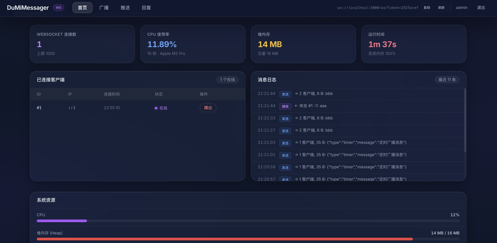
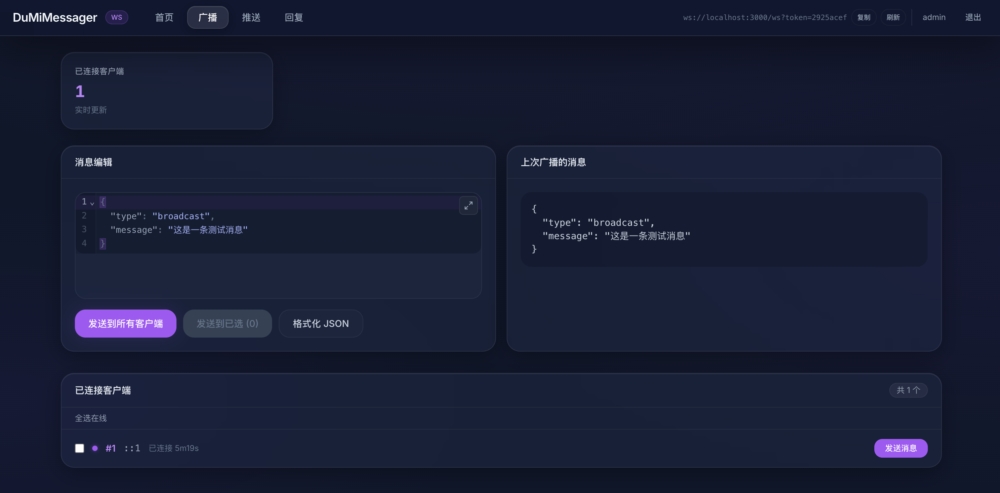
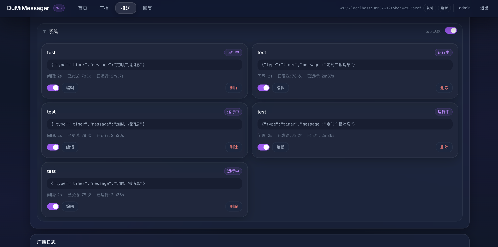
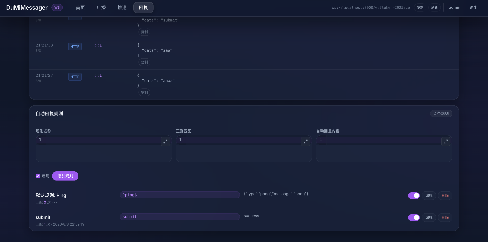

# DuMiMessager
> 基于 **SvelteKit** + WebSocket 的消息管理工具，前端使用 **Svelte 5** + **Tailwind CSS**（Purple 主题）。底层使用了反Medo/X框架的DuMi框架进行开发，性能高效稳定。

支持：
- 消息上报（HTTP POST → WebSocket 推送）
- 消息广播（向所有/指定客户端推送）
- 定时循环广播
- 自动回复规则（正则匹配）
- 消息日志与系统监控

可用于模拟 WebSocket、MQTT 服务，WS 开发等环境。









## 快速开始

### 开发模式

```bash
npm install
npm run dev
```

前端开发服务器地址：`http://localhost:5173`，API 和 WebSocket 由 SvelteKit 统一处理。

### 生产模式

```bash
# 1. 构建
npm run build

# 2. 启动服务
npm start
```

访问 `http://localhost:3000`。默认账号密码: admin/admin123

可通过环境变量 `WS_REQUIRE_TOKEN=true` 开启 WebSocket token 鉴权；默认关闭。

## Docker 部署

```bash
docker volume create ws_data
docker run -d --name ws-server -p 3000:3000 -v ws_data:/app/data meterxu/ws-server:latest
```

### docker-compose

```yaml
services:
  ws-server:
    image: meterxu/ws-server:latest
    ports:
      - "3000:3000"
    environment:
      WS_REQUIRE_TOKEN: "true"
    volumes:
      - ws_data:/app/data

volumes:
  ws_data:
```

## 项目结构

```
ws-server/
├── server.js              # 生产模式入口（HTTP + WebSocket）
├── src/
│   ├── hooks.server.js    # 服务端钩子（CORS 等）
│   ├── app.html           # HTML 模板
│   ├── app.css            # 全局样式
│   ├── routes/
│   │   ├── +layout.svelte # 布局
│   │   ├── +page.svelte   # 首页 / 仪表盘
│   │   ├── admin/         # 广播管理
│   │   ├── timer/         # 定时推送
│   │   ├── reports/       # 回复规则 + 消息日志
│   │   └── api/           # REST API 端点 (+server.js)
│   └── lib/
│       ├── components/    # 共享 UI 组件
│       ├── server/        # 服务端模块
│       │   ├── db.js      # SQLite 数据库
│       │   └── ws.js      # WebSocket 服务
│       └── utils/         # 工具函数
├── static/                # 静态资源
├── build/                 # 构建输出（npm run build）
└── data/                  # 持久化数据 SQLite（volume mount）
```

## 技术栈

- **框架**: SvelteKit 2 (全栈，API + 前端 + WebSocket)
- **WebSocket**: ws
- **数据库**: better-sqlite3 (WAL 模式)
- **前端**: Svelte 5, Tailwind CSS, CodeMirror 6
- **部署**: @sveltejs/adapter-node (单进程 HTTP + WS)
